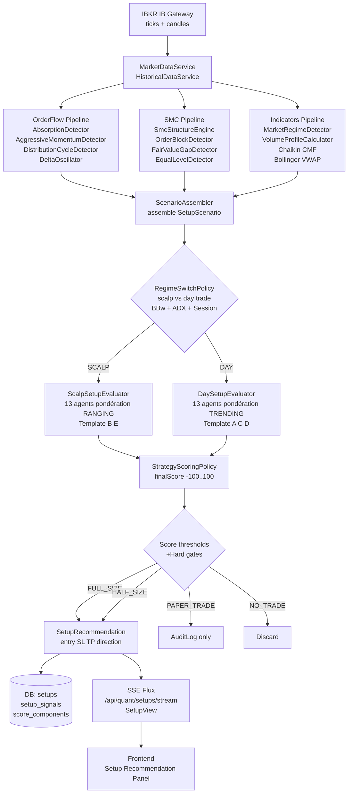
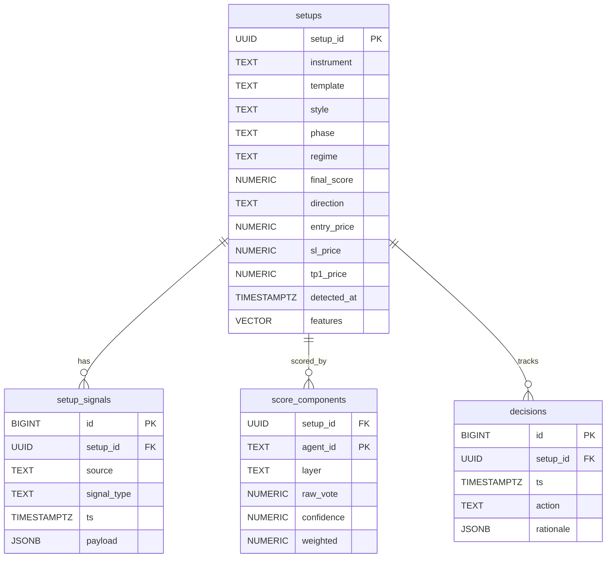
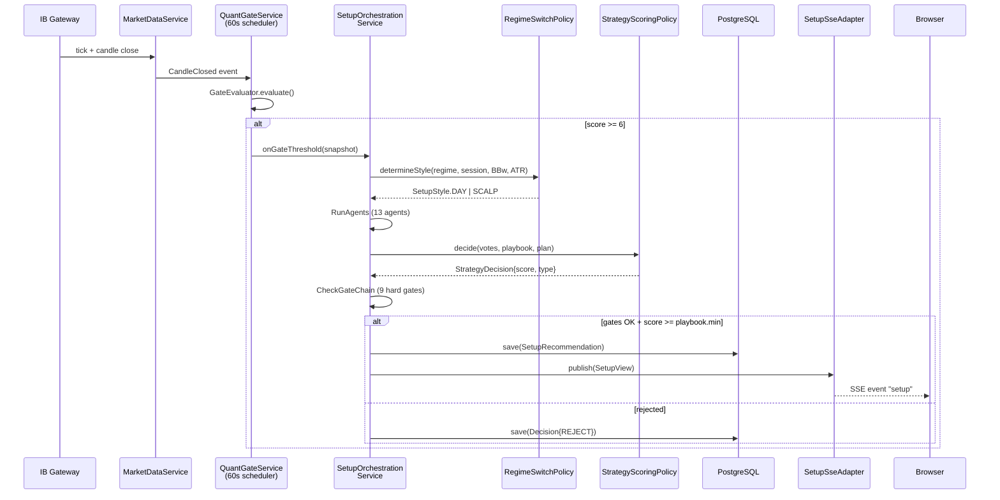
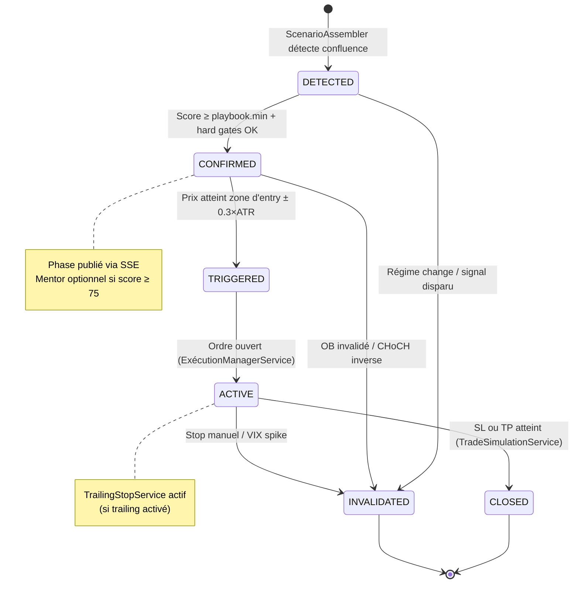

# Fusion scalping + day trading sur RiskDesk2 — Analyse fonctionnelle, matrice de décision et plan d'implémentation

> **Auteur :** Claude Code (Sonnet 4.6) — analyse purement fonctionnelle, lecture seule.  
> **Date :** 2026-05-01  
> **Base :** branche `claude/gallant-ramanujan-295913`, inventaire confirmé par grep/glob sur chaque composant cité.

---

## 0. Executive summary

RiskDesk2 dispose déjà de **tous les composants signals nécessaires** pour une stratégie de fusion scalping + day trading institutionnelle : deux moteurs de décision coexistent (Quant 7-Gates déterministe et Strategy Engine multiagent coté), douze détecteurs d'order flow, sept détecteurs SMC, six playbooks nommés par session, et un régime detector à fast-path momentum. Le **gap actuel** n'est pas un manque de signal mais l'absence d'une **matrice de scoring unifiée** qui orchestre ces composants selon le style de trade (scalp vs day), le régime (RANGING/TRENDING), et la session (London/NY).

Ce document définit cette matrice, les cinq templates de confluence prioritaires, les six filtres de protection, la logique de bascule dynamique scalp↔day, le schéma DB additif, les interfaces Java à créer, et une roadmap en 4 phases. Aucune ligne de production n'est modifiée ici.

**Points clés :**
1. Quant 7-Gates (`GateEvaluator`) = garde-fou order-flow court-terme ; Strategy Engine (`StrategyScoringPolicy`) = conviction multi-timeframe.
2. Les six playbooks existants (LS, NOR, SilverBullet, LSAR, SBDR, CTX) couvrent déjà les setups day-trade principaux. Le scalp nécessite un 7e playbook dédié ou l'extension d'LSAR.
3. La bascule scalp/day est encodable à partir de `MarketRegimeDetector` + `bbExpanding` + `SessionTimingAgent` — aucun nouvel indicateur externe requis.
4. Le schéma DB additif (`setups`, `setup_signals`, `score_components`) est compatible avec la couche hexagonale existante et avec pgvector déjà installé.

---

## 1. Inventaire vérifié des composants signaux existants

### 1.1 Order Flow

| Composant | Classe principale | File:line | Timeframe / fréquence | Payload clé |
|---|---|---|---|---|
| **AbsorptionDetector** | `AbsorptionDetector` | `domain/orderflow/service/AbsorptionDetector.java:19` | Per tick | `AbsorptionSignal {side, absorptionScore, aggressiveDelta, priceMoveTicks, totalVolume}` |
| **AggressiveMomentumDetector** | `AggressiveMomentumDetector` | `domain/orderflow/service/AggressiveMomentumDetector.java:37` | Per tick, max 2/min | `MomentumSignal {side, momentumScore, aggressiveDelta, priceMovePoints}` |
| **DistributionCycleDetector** | `DistributionCycleDetector` | `domain/orderflow/service/DistributionCycleDetector.java:31` | Per phase change | `SmartMoneyCycleSignal {phase, cycleType, confidence}` |
| **DeltaOscillator** | `DeltaOscillator` | `domain/orderflow/service/DeltaOscillator.java:17` | Per tick | `{oscillator, bias: BULLISH/BEARISH/NEUTRAL}` |
| **FootprintAggregator** | `FootprintAggregator` | `domain/orderflow/service/FootprintAggregator.java:22` | Per bar snapshot | `FootprintBar {levels, poc, buyTotal, sellTotal, delta, imbalanceFlag}` |
| **IcebergDetector** | `IcebergDetector` | `domain/orderflow/service/IcebergDetector.java:29` | Per wall event window | `IcebergSignal {side, priceLevel, rechargeCount, avgRechargeSize, icebergScore}` |
| **SpoofingDetector** | `SpoofingDetector` | `domain/orderflow/service/SpoofingDetector.java:24` | Per wall event window | `SpoofingSignal {side, priceLevel, wallSize, durationSeconds, priceCrossed, spoofScore}` |
| **SmcOrderFlowEnricher** | `SmcOrderFlowEnricher` | `domain/orderflow/service/SmcOrderFlowEnricher.java:17` | Per zone enrichment | `OrderBlockEnrichment, FvgEnrichment, BreakEnrichment, LiquidityEnrichment` |
| **InstitutionalDistributionDetector** | `InstitutionalDistributionDetector` | `domain/orderflow/service/InstitutionalDistributionDetector.java:29` | Per absorption event | `DistributionSignal {type: DISTRIBUTION\|ACCUMULATION, consecutiveCount, avgScore, confidenceScore}` |
| **DeltaFlowProfile** | `DeltaFlowProfile` | `domain/engine/indicators/DeltaFlowProfile.java:21` | Per bar | `DeltaFlowResult {currentDelta, cumulativeDelta, buyRatio, bias: BUYING\|SELLING\|NEUTRAL}` |
| **VolumeProfileCalculator** | `VolumeProfileCalculator` | `domain/engine/indicators/VolumeProfileCalculator.java:14` | Per session | `VolumeProfileResult {pocPrice, valueAreaHigh, valueAreaLow}` |
| **SessionPdArrayCalculator** | `SessionPdArrayCalculator` | `domain/engine/smc/SessionPdArrayCalculator.java:38` | Per price snapshot | `PdArrayResult {zone: PREMIUM\|DISCOUNT\|EQUILIBRIUM\|UNDEFINED, equilibrium, premiumStart, discountEnd}` |
| **OrderFlowPatternDetector** | `OrderFlowPatternDetector` | `domain/quant/pattern/OrderFlowPatternDetector.java:27` | Per scan (60 s) | `PatternAnalysis {pattern: ABSORPTION_HAUSSIERE\|DISTRIBUTION_SILENCIEUSE\|VRAIE_VENTE\|VRAI_ACHAT, confidence}` |

### 1.2 SMC

| Composant | Classe principale | File:line | Timeframe | Payload clé |
|---|---|---|---|---|
| **SmcStructureEngine** | `SmcStructureEngine` | `domain/engine/smc/SmcStructureEngine.java:1` | Configurable (5/50 bar lookback) | `StructureSnapshot {internalBias, swingBias, events: [BOS/CHoCH], trailingTop, trailingBottom}` |
| **EqualLevelDetector** | `EqualLevelDetector` | `domain/engine/smc/EqualLevelDetector.java:1` | Per pivot detection | `LiquidityPool {type: EQH\|EQL, price, touchCount, swept, sweptTime}` |
| **FairValueGapDetector** | `FairValueGapDetector` | `domain/engine/smc/FairValueGapDetector.java:1` | Per 3-bar pattern | `FairValueGap {bias: BULLISH\|BEARISH, top, bottom, startBarTime}` |
| **OrderBlockDetector** | `OrderBlockDetector` | `domain/engine/smc/OrderBlockDetector.java:1` | Per impulse formation | `OrderBlock {type, status: ACTIVE\|MITIGATED\|BREAKER, highPrice, lowPrice, midPoint}` |
| **PlaybookEvaluator** | `PlaybookEvaluator` | `domain/engine/playbook/PlaybookEvaluator.java:1` | Per evaluation tick | `PlaybookEvaluation {filters, bestSetup, plan, checklist, checklistScore, verdict}` |
| **ZoneRetestDetector** | `ZoneRetestDetector` | `domain/engine/playbook/detector/ZoneRetestDetector.java:1` | Per bar | `SetupCandidate {type: ZONE_RETEST, zoneHigh, zoneLow, distanceFromPrice, priceInZone}` |
| **LiquiditySweepDetector** | `LiquiditySweepDetector` | `domain/engine/playbook/detector/LiquiditySweepDetector.java:1` | Per bar | `SetupCandidate {type: LIQUIDITY_SWEEP, priceInZone, orderFlowConfirms}` |
| **BreakRetestDetector** | `BreakRetestDetector` | `domain/engine/playbook/detector/BreakRetestDetector.java:1` | Per bar | `SetupCandidate {type: BREAK_RETEST, zoneMid, rrRatio, checklistScore}` |
| **CrossInstrumentCorrelationEngine** | `CrossInstrumentCorrelationEngine` | `domain/engine/correlation/CrossInstrumentCorrelationEngine.java:1` | Per MCL/MNQ tick | `CrossInstrumentSignal {state: CONFIRMED, mclBreakoutPrice, correlationWindow: 10 min}` |

### 1.3 Indicateurs classiques

| Indicateur | Classe | File:line | Paramètres |
|---|---|---|---|
| RSI | `RSIIndicator` | `domain/engine/indicators/RSIIndicator.java` | Période 14 |
| MACD | `MACDIndicator` | `domain/engine/indicators/MACDIndicator.java` | 12/26/9 |
| Bollinger Bands | `BollingerBandsIndicator` | `domain/engine/indicators/BollingerBandsIndicator.java` | 20 périodes |
| EMA | `EMAIndicator` | `domain/engine/indicators/EMAIndicator.java` | 9, 50, 200 |
| ATR | `AtrCalculator` | `domain/engine/indicators/AtrCalculator.java` | Configurable |
| WaveTrend | `WaveTrendIndicator` | `domain/engine/indicators/WaveTrendIndicator.java` | 10/21/4 |
| Stochastic | `StochasticIndicator` | `domain/engine/indicators/StochasticIndicator.java` | 14/3/3 |
| VWAP | `VWAPIndicator` | `domain/engine/indicators/VWAPIndicator.java` | Reset midnight ET |
| Supertrend | `SupertrendIndicator` | `domain/engine/indicators/SupertrendIndicator.java` | — |
| Chaikin CMF | `ChaikinIndicator` | `domain/engine/indicators/ChaikinIndicator.java` | CMF20 |

### 1.4 Contexte / Régime

| Composant | Classe | File:line | Résultat |
|---|---|---|---|
| **MarketRegimeDetector** | `MarketRegimeDetector` | `domain/engine/indicators/MarketRegimeDetector.java:1` | `TRENDING_UP \| TRENDING_DOWN \| RANGING \| CHOPPY` (fast-path momentum : 1.8σ sur 6 bougies) |
| **SessionTimingAgent** | `SessionTimingAgent` | `domain/engine/strategy/agent/context/SessionTimingAgent.java` | Veto maintenance/closed, info kill-zone London/NY |
| **MtfSnapshot** | `MtfSnapshot` | `domain/engine/strategy/model/MtfSnapshot.java:1` | H1/H4/Daily bias, `alignmentWith(direction)` compte 0-3 |
| **CrossInstrumentCorrelation** | `CrossInstrumentCorrelationEngine` | `domain/engine/correlation/CrossInstrumentCorrelationEngine.java:1` | ONIMS : MCL breakout → MNQ VWAP rejection dans 10 min |
| **CmfFlowAgent** | `CmfFlowAgent` | `domain/engine/strategy/agent/context/CmfFlowAgent.java` | ±70 (conf `4×\|cmf\|`) pour `\|cmf\|>0.15` |
| **VolumeProfileContextAgent** | `VolumeProfileContextAgent` | `domain/engine/strategy/agent/context/VolumeProfileContextAgent.java` | ±40 (conf 0.65) BELOW_VAL/ABOVE_VAH |

### 1.5 DecisionEngine — extraction des règles

**Architecture duale :**

```
Quant 7-Gates (GateEvaluator)         Strategy Engine (DefaultStrategyEngine)
━━━━━━━━━━━━━━━━━━━━━━━━━━━━━━         ━━━━━━━━━━━━━━━━━━━━━━━━━━━━━━━━━━━━━
G0  Régime (dayMove/ABS bull)          PlaybookSelector → Playbook (6 disponibles)
G1  ABS BEAR / BULL n8≥8               13 agents → AgentVotes
G2  DIST/ACCU persistence ≥2/3         StrategyScoringPolicy :
G3  Delta < -100 / > +100                CONTEXT×0.50 + ZONE×0.30 + TRIGGER×0.20
G4  BuyPct < 48 / > 52                  Hard veto, coherence gate, magnitude buckets
G5  ACCU/DIST threshold adaptive       → DecisionType: NO_TRADE/MONITORING/PAPER/HALF/FULL
G6  LIVE_PUSH price source
→ score 0-7, shortBlocked/longBlocked  StructuralFilterEvaluator (blocks + warnings/modifiers)
  disponible si ≥6                     AutoArmEvaluator (auto-arm si score≥cfg.minScore)
```

**Formule StrategyScoringPolicy** (`domain/engine/strategy/policy/StrategyScoringPolicy.java:62`) :

```
LayerScore(layer) = Σ(vote × confidence) / Σ(confidence)   [non-abstain, non-veto]
finalScore = 0.50 × CONTEXT + 0.30 × ZONE + 0.20 × TRIGGER  ∈ [-100, 100]

|finalScore| < 30        → NO_TRADE
30 ≤ |finalScore| < min  → PAPER_TRADE
min ≤ |finalScore| < min+20 → HALF_SIZE
|finalScore| ≥ min+20   → FULL_SIZE
```

**Filtres structuraux** (`domain/quant/structure/StructuralFilterEvaluator.java`) :
- **Blocks** (veto hard) : OB_BULL/BEAR_FRESH, REGIME_CHOPPY, MTF_BULL/BEAR (≥4/5), JAVA_NO_TRADE_CRITICAL
- **Warnings** (malus) : VWAP_FAR(−2), BB_LOWER/UPPER(−1), CMF_VERY_BULL/BEAR(block/−1), PRICE_IN_DISCOUNT/PREMIUM(−2), SWING_BULL/BEAR(−1), EQUAL_LOWS/HIGHS_NEAR(−1)
- **Kill-zone override** : si score=7/7 + 5/5 TF alignés + CMF≥0.10 → warning → info

---

## 2. Analyse fonctionnelle par composant

### 2.1 AbsorptionDetector

**Objectif :** Détecter quand des ordres agressifs dans une direction sont absorbés par des teneurs de marché passifs dans l'autre sens — signature institutionnelle d'accumulation/distribution discrète.

**Calcul** (`AbsorptionDetector.java:26`) : `score = (|delta|/deltaThreshold) × (1 - priceMoveTicks/ATR) × (volume/avgVolume)` ; seuil `SCORE_THRESHOLD = 2.0`. Delta négatif + prix stable = `BULLISH_ABSORPTION` ; delta positif + prix stable = `BEARISH_ABSORPTION`.

**Fiabilité par régime :**
- TRENDING : fiabilité **faible** si le prix suit le delta (absorption réelle moins probable en tendance forte) ; fiabilité **forte** aux points de retournement de tendance.
- RANGING : fiabilité **haute** — c'est le pattern typique de la zone de value (Trader Dale, *Volume Profile — The Insider's Guide*, ch. 4).

**Pertinence par style :**
- Scalp : **haute** — l'absorption se forme sur quelques dizaines de ticks, confirme l'entrée intrabar.
- Day trade : **moyenne** — sert de filtre de qualité sur le setup mais ne suffit pas seul pour un hold de plusieurs heures.

**Faiblesses :** Faux positifs en basse liquidité (Asian session) ; `avgVolume` calculé sur la fenêtre courante sans normalisation de session.

**Référence :** Trader Dale, *Volume Profile — The Insider's Guide* : absorption = test de liquidité institutionnel. ICT : "Judas Swing" — stop hunt + absorption avant reversal.

---

### 2.2 AggressiveMomentumDetector

**Objectif :** Inverse de l'absorption — détecter les poussées directionnelles non absorbées qui signalent une cassure de structure en cours.

**Calcul** (`AggressiveMomentumDetector.java:126`) : score sigmoid `0.40×Sig(Δ) + 0.35×Sig(price) + 0.25×Sig(vol)` ; seuil 0.55 ; rate-cap 2 fires/min.

**Fiabilité :** TRENDING **haute** (confirme la direction) ; RANGING **basse** (faux breakouts fréquents — Connors, *Street Smarts*).

**Pertinence :** Scalp **très haute** (le momentum burst est l'entrée scalp par excellence) ; Day trade **moyenne** (signal d'entrée sur breakout).

**Faiblesses :** Debounce par price-distance peut rater les doubles poussées rapides (MNQ à l'ouverture NY).

---

### 2.3 DistributionCycleDetector

**Objectif :** Chaîner trois phases d'order flow en un cycle smart-money complet : distribution initiale → momentum de continuation → contre-distribution miroir.

**Machine à états** (`DistributionCycleDetector.java:18`) : `NONE → PHASE_1 → PHASE_2 → COMPLETE` ; fenêtre momentum 10 min, fenêtre miroir 20 min, cooldown 5 min. Confidence 40-100 % selon la phase.

**Fiabilité :** TRENDING **haute** (cycle bearish dans une tendance baissière = confirmation forte) ; RANGING **haute** sur retournement de zone.

**Pertinence :** Day trade **haute** (le cycle complet = signal HTF de 30-60 min) ; Scalp **basse** (trop lent pour le scalp pur).

**Référence :** Wyckoff Distribution Phases (A-E) — la séquence DIST→MOMENTUM→DIST_MIROIR correspond aux phases C-D de la distribution Wyckoff.

---

### 2.4 DeltaOscillator

**Objectif :** EMA du delta cumulé (fast=3, slow=10) pour mesurer la pression directionnelle nette en temps réel.

**Calcul** (`DeltaOscillator.java:11`) : `osc = EMA(fast) - EMA(slow)` ; `>+0.5 = BULLISH, <-0.5 = BEARISH`.

**Fiabilité :** Tous régimes — indicateur de flux brut, non régime-dépendant. Plus utile comme confirmateur que comme signal primaire.

**Pertinence :** Scalp **haute** (oscillateur réactif) ; Day trade **moyenne** (bruit élevé sur les timeframes longs).

---

### 2.5 FootprintAggregator

**Objectif :** Construire une cartographie prix/volume par tick pour visualiser l'imbalance acheteurs/vendeurs à chaque niveau de prix.

**Calcul** (`FootprintAggregator.java:132`) : imbalance si un côté domine à 3:1. POC = niveau de plus haut volume total.

**Fiabilité :** RANGING **très haute** (le POC footprint est le niveau de retour le plus probable) ; TRENDING **moyenne** (le POC migre avec la tendance).

**Pertinence :** Scalp **très haute** — c'est l'outil de scalp numéro 1 (Trader Dale) ; Day trade **haute** sur confirmation de zone.

---

### 2.6 IcebergDetector

**Objectif :** Détecter les ordres cachés institutionnels qui rechargent après exécution partielle — signal d'accumulation/distribution masquée.

**Calcul** (`IcebergDetector.java:31`) : ≥2 cycles APPEARED→DISAPPEARED→APPEARED en 60 s, score = `min(100, recharges×25 + (avgSize>200 ? 20 : 0))`.

**Fiabilité :** Hors session asiatique uniquement (basse liquidité = faux icebergs). Fiabilité **haute** sur London/NY open.

**Pertinence :** Scalp **haute** (identifie le niveau de défense institutionnel) ; Day trade **haute** (zone d'entry premium).

---

### 2.7 SpoofingDetector

**Objectif :** Détecter les ordres fantômes (placés + retirés <10 s) pour identifier les tentatives de manipulation directionnelle.

**Calcul** (`SpoofingDetector.java:85`) : `spoofScore = (wallSize/avgSize) × (1/max(duration,0.5)) × (priceCrossed ? 2.0 : 1.0)`.

**Fiabilité :** Régime-indépendant. Utile comme **filtre négatif** — le spoofing précède souvent un move artificiel suivi d'un reversal.

**Pertinence :** Scalp **haute** (éviter les entrées sur manipulation) ; Day trade **moyenne** (signal de court-terme).

---

### 2.8 SmcOrderFlowEnricher

**Objectif :** Enrichir les zones SMC (OB, FVG, breaks, liquidité) avec des métriques order-flow pour scorer leur qualité dynamiquement.

**Méthodes** (`SmcOrderFlowEnricher.java:39`) :
- `enrichOrderBlock` : score = `(formationScore×0.4) + min(absorptionComponent, 60)` ; défendu si absorption > 2.0 ET prix stable.
- `enrichFvg` : `imbalanceIntensity×120`, max 100.
- `enrichBreak` : `volumeSpike×20 + (deltaAligned ? 40 : 0)`, max 100.

**Pertinence :** Critique pour les deux styles — c'est le pont entre SMC et order flow.

---

### 2.9 InstitutionalDistributionDetector

**Objectif :** Détecter la pression institutionnelle soutenue à partir de 3+ absorptions consécutives du même côté (pattern de distribution/accumulation professionnel).

**Seuils** (`InstitutionalDistributionDetector.java:32`) : ≥3 absorptions consécutives, score moyen ≥2.5, gap inter-événement ≤20 s, TTL 10 min, cooldown 8 min. Confidence 50-95%.

**Fiabilité :** RANGING **très haute** (accumulation = rebond imminent) ; TRENDING **haute** (distribution = retournement).

**Référence :** Trader Dale, footprint et clusters d'absorption — "institutional fingerprint" (ch. 6).

---

### 2.10 SmcStructureEngine

**Objectif :** Détecter les pivots internes (lookback=5) et de swing (lookback=50) et classifier BOS vs CHoCH — fondation de la lecture SMC.

**Logique** (`SmcStructureEngine.java:207`) : confirmation right-side uniquement (lookback bars de retard). BOS = cassure dans le sens du bias courant ; CHoCH = cassure contre le bias = changement de caractère.

**Fiabilité :** TRENDING **haute** pour BOS (continuation) ; RANGING **haute** pour CHoCH (retournement). Filtre de confluence UC-SMC-008 supprime les cassures internes contre le swing bias.

**Référence :** Inner Circle Trader (ICT) — "Market Structure Shift" = CHoCH interne confirmant un retournement HTF.

---

### 2.11 OrderBlockDetector

**Objectif :** Identifier les zones de prix où la smart money a initié une position importante (OB actif = support/résistance institutionnel).

**Logique** (`OrderBlockDetector.java:100`) : bearish candle + 2 bougies haussières avec body/range ≥0.5 = OB bullish ; mitigation = prix reteste le haut de l'OB ; invalidation = clôture sous le bas = OB devient breaker.

**Fiabilité :** Très haute sur LTF (5-15m) pour les scalps ; forte sur HTF (1H+) pour les day trades.

**Référence :** ICT, "Fair Value Gap & Order Block" methodology.

---

### 2.12 MarketRegimeDetector

**Objectif :** Classifier le régime TRENDING/RANGING/CHOPPY pour adapter le poids de chaque famille de signaux.

**Logique** (`MarketRegimeDetector.java:62`) :
- TRENDING_UP : `EMA9 > EMA50 > EMA200 AND bbExpanding`
- TRENDING_DOWN : `EMA9 < EMA50 < EMA200 AND bbExpanding`
- RANGING : `|EMA9 - EMA50| ≤ 0.2% AND !bbExpanding`
- CHOPPY : tout le reste
- **Fast-path** (ligne 110) : si `|close[n] - close[n-6]| > 1.8 × ATR × √6` → TRENDING_* immédiat (contourne le lag EMA).

**Pertinence :** Central pour le switch scalp/day (cf. section 5).

---

### 2.13 StrategyScoringPolicy + 13 Agents

Les 13 agents votent par couche (CONTEXT 50%, ZONE 30%, TRIGGER 20%) avec des votes [-100,+100] pondérés par confidence [0,1]. Résumé des votes clés :

| Agent | Vote clé | Condition déclenchante |
|---|---|---|
| SmcMacroBiasAgent | ±70 (conf 0.85) | Swing bias BULL/BEAR |
| HtfAlignmentAgent | ±90 (conf 0.90) | 3/3 HTF alignés |
| RegimeContextAgent | ±50 (conf 0.75) | TRENDING + macro BULL/BEAR |
| VolumeProfileContextAgent | ±40 (conf 0.65) | Prix BELOW_VAL / ABOVE_VAH |
| CmfFlowAgent | ±70 (conf ∝|cmf|×4) | \|CMF\|>0.15 |
| OrderBlockZoneAgent | ±60 (conf ∝OB.quality) | Prix dans OB ± 0.5×ATR |
| LiquidityZoneAgent | ±35 (conf min(0.9, 0.3+0.15×touches)) | EQH/EQL à ±0.5×ATR |
| DeltaFlowTriggerAgent | ±70 (ABSORPTION), ±50 (FLOW) | Pattern delta vs prix |
| RiskGateAgent | Veto | DD>3%, margin>80%, corr>0.6 |
| SessionTimingAgent | Veto | Maintenance, marché fermé |

---

## 3. Patterns de confluence à privilégier

### 3.1 Template A — Sweep + CHoCH + OB + FVG + Delta (day-trade A+, TRENDING)

**Conditions** (toutes requises) :
1. HTF (1H) bias BULLISH : `SmcSwing.bias = BULLISH` ET `price > EMA200(1H)` → `HtfAlignmentAgent ≥2/3`
2. Régime TRENDING_UP sur 15m : `MarketRegimeDetector.detect(...)` = TRENDING_UP OR fast-path >1.8σ
3. Sweep EQL (15m) : `EqualLevelDetector.detectPools()` → pool swept (`swept=true`, `touchCount≥2`)
4. CHoCH interne 5m : `SmcStructureEngine.StructureEvent.type=CHOCH, level=INTERNAL, newBias=BULLISH`
5. OB bullish fresh sur 5m dans zone DISCOUNT : `OrderBlockDetector.status=ACTIVE` + `SessionPdArrayCalculator.zone=DISCOUNT`
6. FVG bullish chevauche l'OB : `FairValueGapDetector.bias=BULLISH` + overlap OB ≥50%
7. Absorption footprint : `AbsorptionDetector.side=BULLISH_ABSORPTION, score≥2.0` DANS l'OB
8. Delta divergence positive : `DeltaOscillator.bias=BULLISH` alors que prix faisait Lower Low
9. RSI(14) sort de <30 vers le haut + Stochastic %K cross %D vers le haut

**Entry :** limite à `OrderBlock.highPrice` (ou market sur retest `FVG.bottom`)  
**SL :** `OrderBlock.lowPrice - 1.2×ATR(5m)`  
**TP1 :** POC session courante (`VolumeProfileCalculator.pocPrice`) → R:R ~1.7  
**TP2 :** Swing high précédent (`SmcStructureEngine.trailingTop`) → R:R ~3.5  
**Trail :** à TP1 atteint, SL → break-even ; trail sur CHoCH interne 5m  
**Instruments éligibles :** MNQ, MGC ; MCL si session London (volatile)  
**Score attendu StrategyScoringPolicy :** ≥70 → FULL_SIZE  

**Justification :** Le sweep d'EQL = stop hunt institutionnel (ICT, "liquidity grab"). OB + FVG en discount = OTE (Optimal Trade Entry, 0.62-0.79 du range ICT). Absorption dans l'OB = signature d'épuisement vendeur (Trader Dale, ch. 6). RSI extrême = momentum reset (Connors, *RSI-2*). Alignement HTF = trade dans le sens de l'auction (Wyckoff, *Studies in Tape Reading*).

---

### 3.2 Template B — VAL/VAH Reject + Absorption + RSI/Stoch (scalp mean-reversion, RANGING)

**Conditions** :
1. Régime RANGING : `MarketRegimeDetector` = RANGING + `bbExpanding = false`
2. Prix ABOVE_VAH : `VolumeProfileContextAgent.vaPosition = ABOVE_VAH` OU BELOW_VAL
3. Absorption à l'extrême : `AbsorptionDetector.side = BEARISH_ABSORPTION` (si prix au-dessus de VAH) avec score ≥3.0
4. RSI(14) >70 (SHORT) ou <30 (LONG) sur 5m
5. Stochastic : %K > 80 + cross vers le bas (SHORT) ou <20 + cross vers le haut (LONG)
6. BollingerPositionAgent : `%B > 0.90` (SHORT) ou `<0.10` (LONG)

**Entry :** market à la clôture de la bougie d'absorption confirmée  
**SL :** 0.5×ATR au-delà de l'extrême Bollinger (VAH + buffer si SHORT)  
**TP :** POC (`VolumeProfileCalculator.pocPrice`) → R:R 1:1 à 1.5  
**Style :** Scalp pur (durée 5-20 min)  
**Instruments :** Tous (MCL le plus volatile en RANGING oil sessions)  

**Justification :** Mean-reversion sur valeur 70% de volume (Steidlmayer, Market Profile). Absorption + RSI extrême = confluence "3 touches confirmées" (Connors, *Street Smarts*). %B >0.90 = extension statistique 2-sigma (Bollinger, *Bollinger on Bollinger Bands*).

---

### 3.3 Template C — Naked POC Magnet (day-trade continuation, TRENDING)

**Conditions** :
1. TRENDING + Swing bias BULLISH (LONG) : `SmcMacroBiasAgent = BULLISH`
2. Naked POC (session D-1 non retesté) : `VolumeProfileCalculator.pocPrice` de la session précédente intrabar mais pas encore retesté
3. Prix en pullback vers le POC naked (DISCOUNT ou EQUILIBRIUM) : `SessionPdArrayCalculator.zone = DISCOUNT|EQUILIBRIUM`
4. `DeltaFlowTriggerAgent` vote FLOW bullish : `buyRatio > 55%`
5. EMA200 support sur 15m : `VwapDistanceAgent` σ ≤ 0.5 (prix proche VWAP)

**Entry :** limite au POC naked ± 0.3×ATR  
**SL :** sous le bas du pullback + 0.5×ATR  
**TP :** extension 1.618×ATR vers swing high → R:R ~2.5  
**Style :** Day trade (hold potentiel jusqu'à fin session)  
**Instruments :** MNQ (POC très magnétique), MGC  

**Justification :** Wyckoff — le prix retourne systématiquement au Point of Control (zone d'équilibre). Steidlmayer : "naked POC = highest-probability magnet". ICT : "Fair value retracement = clean entry".

---

### 3.4 Template D — Multi-TF SMC Alignment (swing + internal + micro, tous régimes)

**Conditions** :
1. `MtfSnapshot.alignmentWith(LONG) ≥ 2` (H1 + H4 ou H1 + Daily BULLISH)
2. Swing bias BULLISH : `SmcStructureEngine (swingLookback=50).internalBias = BULLISH`
3. BOS interne bullish sur 5m récent (<3 bougies) : `StructureEvent.type=BOS, level=INTERNAL`
4. OB bullish actif sur 10m retesté : `OrderBlockDetector` avec `status=ACTIVE, distanceFromPrice ≤ 0.5×ATR`
5. CMF positif : `CmfFlowAgent.cmf > 0.05`

**Entry :** retest de l'OB 10m dans les 2 bougies suivant le BOS  
**SL :** sous l'OB low - ATR×0.25  
**TP1 :** 2R, TP2 : swing high D-1  
**Style :** Day trade (confluence multi-TF = conviction forte)  

**Justification :** ICT — alignement multi-TF = "premium setup" (HTF structure + LTF entry = institutionnel). Steenbarger (*The Psychology of Trading*) : les meilleures trades combinent conviction HTF + timing LTF.

---

### 3.5 Template E — FVG Fill + Liquidity Sweep + Absorption (universel, tous instruments)

**Conditions** :
1. `LiquiditySweepDetector` confirme le sweep : `SetupCandidate.type=LIQUIDITY_SWEEP, priceInZone=true`
2. FVG bullish/bearish non rempli dans la direction : `FairValueGapDetector.bias=BULLISH` (LONG)
3. Absorption confirmée dans le FVG : `SmcOrderFlowEnricher.enrichFvg().qualityScore ≥ 70`
4. Prix re-rentre dans le FVG après le sweep
5. Delta divergence : `OrderFlowPatternDetector = ABSORPTION_HAUSSIERE` (LONG)

**Entry :** FVG midpoint après confirmation absorption  
**SL :** FVG bottom - 0.25×ATR (LONG) ; FVG top + 0.25×ATR (SHORT)  
**TP1 :** 2.5R (silver-bullet standard), TP2 : 4R  
**Style :** Adaptable scalp/day selon volume du FVG  
**Instruments :** Tous  

**Justification :** ICT "Silver Bullet" strategy (FVG + sweep = point d'entrée optimal). Trader Dale : absorption dans un FVG = "trap and reverse" institutionnel.

---

## 4. Patterns de filtration (when NOT to trade)

### 4.1 Régime contradictoire

**Règle :** Ne pas trader un setup de type Continuation si `MarketRegimeDetector` = RANGING ou CHOPPY. Ne pas trader un Mean-Reversion si TRENDING_* avec `bbExpanding=true`.

**Implémentation existante :** `RegimeContextAgent` vote ±10 (conf 0.40) en CHOPPY — le score final descend sous le plancher de PAPER_TRADE_FLOOR=30. Filtre `REGIME_CHOPPY` dans `StructuralFilterEvaluator` bloque également.

**Critère quantitatif :** Si `ADX(14) < 20 ET bbWidth percentile < 30%` → RANGING obligatoire. Si `ADX > 25 ET bbWidth percentile > 60%` → TRENDING.

---

### 4.2 DXY / corrélations macro

**Règle :** Blackout si `|ρ(MCL, MNQ)_rolling_12h| > 0.6` et que les deux sont dans le même sens que le setup (double exposition).

**Implémentation existante :** `RiskGateAgent` veto `correlated-position-cap` si ≥3 positions ouvertes + position corrélée. `CrossInstrumentCorrelationEngine` détecte le pattern inverse MCL/MNQ (ONIMS).

**Extension requise :** Ajouter un gate DXY : si `DxyMarketService.currentBias=STRONG_DOLLAR` et setup LONG sur 6E → filtrer.

---

### 4.3 Blackout news / VIX

**Règle :** Interdire l'entrée -2 min / +5 min autour de FOMC, NFP, CPI ; EIA Mercredi 10h30 ET pour MCL. Si VIX > 28 → taille 50%, si VIX > 35 → stop total.

**Implémentation existante :** `SessionTimingAgent` veto `maintenance-window` (16h-18h ET). Extension : ajouter calendrier news économiques dans `RiskGateAgent` ou nouveau `NewsBlackoutAgent`.

---

### 4.4 Multi-TF contradiction

**Règle :** Bloquer si `MtfSnapshot.alignmentWith(direction) == 0` (zéro timeframe aligné).

**Implémentation existante :** `HtfAlignmentAgent` vote -45 (conf 0.70) si 3/3 opposés → score final fortement négatif. `StructuralFilterEvaluator` block `MTF_BULL/BEAR` si ≥4/5 TF en opposition.

---

### 4.5 Stand-aside band

**Règle :** Si `|finalScore| ∈ [30, playbook.min[` → ne pas trader (zone PAPER_TRADE uniquement). La zone est actuellement [30, 55] pour les playbooks LSAR/LS/NOR et [30, 65] pour SBDR/CTX.

**Implémentation existante :** `StrategyScoringPolicy` produit `PAPER_TRADE` — log seulement, pas d'exécution.

---

### 4.6 Cooldown post-pertes

**Règle :** Après 3 pertes consécutives sur le même instrument → pause 30 min. Après DD journalier ≥ 3% → stop journalier (`RiskGateAgent` veto `daily-drawdown-breach`).

**Implémentation existante :** `RiskGateAgent.java` veto DD>3% et margin>80%. Le cooldown post-3-pertes est **non encore implémenté** — à ajouter dans `RiskGateAgent` avec un compteur de pertes en session [HYPOTHÈSE conf=HIGH].

**Référence :** Steenbarger (*The Daily Trading Coach*) — "After 3 consecutive losses, the brain enters threat mode and rational decision-making is compromised. A mandatory break is protective, not optional."

---

## 5. Switch scalping ↔ day trading

### 5.1 Détection du régime actif

```
╔══════════════════════════════════════════════════════╗
║  CRITÈRES DE SWITCH (calculés sur le TF de référence ║
║  = 15m pour MNQ/MGC, 10m pour MCL)                   ║
╠══════════════════════════════════════════════════════╣
║  bbWidth(20) percentile sur 50 bougies  [BBw]         ║
║  ATR(14) percentile sur 20 sessions     [ATRpct]      ║
║  ADX(14)                                [ADX]         ║
║  Session phase (SessionTimingAgent)     [Phase]       ║
╚══════════════════════════════════════════════════════╝
```

### 5.2 Mapping régime → style

| Condition | Style recommandé | Playbook éligibles | R:R cible |
|---|---|---|---|
| RANGING + BBw_pct < 35% + ADX < 20 | **Scalp** mean-reversion | Template B, LSAR (min_score=55) | 1:1 – 1.5:1 |
| RANGING + kills zones actives | **Scalp** liquidity sweep | Template E, LS/NOR (min_score=55) | 1.5:1 – 2:1 |
| TRENDING + BBw_pct > 55% + ADX > 25 | **Day trade** momentum | Template A/C, SBDR (min_score=65) | 2.5:1 – 5:1 |
| TRENDING + retracement en cours | **Day trade** pullback | Template D, CTX/SilverBullet | 2:1 – 3.5:1 |
| CHOPPY | **Aucun** | Stand-aside | — |

### 5.3 Hystérésis (éviter le whipsaw)

Pour éviter les bascules trop fréquentes en zone limite, appliquer un seuil d'hystérésis :
- Passage RANGING→TRENDING : `BBw_pct > 55% ET ADX > 25 pendant ≥3 bougies consécutives`
- Retour TRENDING→RANGING : `BBw_pct < 40% ET ADX < 22 pendant ≥5 bougies consécutives`

`MarketRegimeDetector.durationCandles()` (`MarketRegimeDetector.java:157`) est déjà disponible pour compter les bougies consécutives en régime stable — réutiliser directement.

---

## 6. Matrice de scoring / décision

### 6.1 Hard gates (boolean — toute condition false = REJECT avant scoring)

| Gate | Condition PASS | Composant existant |
|---|---|---|
| **G_REGIME** | Régime cohérent avec setup type | `MarketRegimeDetector` + hystérésis |
| **G_NEWS** | Pas de blackout (-2/+5 min FOMC/NFP/CPI ; EIA mer. 10h30 ET) | `RiskGateAgent` extension [HYPOTHÈSE conf=HIGH] |
| **G_VIX** | VIX ≤ 28 (taille 50% si 22-28, stop si >35) | `RiskGateAgent` extension (VIX port non câblé) [HYPOTHÈSE conf=MEDIUM] |
| **G_DAILY_STOP** | DD journalier ≤ 3% | `RiskGateAgent.java:41` — `dailyDrawdownPct > 3.0 → veto` |
| **G_COOLDOWN** | ≥30 min depuis 3 pertes consécutives | À implémenter dans `RiskGateAgent` |
| **G_CORREL** | `|ρ rolling 12h(MCL, MNQ)| ≤ 0.6` | `RiskGateAgent.java:43` — `correlated-position-cap` |
| **G_HTF_BIAS** | Alignement swing bias (sauf reversal explicite) | `HtfAlignmentAgent` + `SmcMacroBiasAgent` |
| **G_LIVE_DATA** | Price source = LIVE_PUSH | `GateEvaluator.java:LIVE_PUSH` — G6/L6 |
| **G_MAINTENANCE** | Hors fenêtre 16h-18h ET | `SessionTimingAgent` — veto `maintenance-window` |

### 6.2 Soft gates pondérés (matrice 2D : setup type × famille de signaux)

**Lecture :** chaque cellule = `[poids RANGING / poids TRENDING]` sur une échelle 0-10.

| Setup type | Order Flow | SMC | Classiques | Macro/Régime |
|---|---|---|---|---|
| **Continuation (TREND)** | 2.0 / **3.5** | 2.0 / **3.0** | 1.0 / 1.0 | 2.0 / **3.5** |
| **Reversal (CHoCH+sweep)** | **3.0** / 2.5 | **3.5** / **3.0** | 1.5 / 1.5 | 2.0 / 2.0 |
| **Range mean-reversion** | **2.5** / 1.0 | 1.0 / 0.5 | **3.0** / 2.0 | **3.5** / 1.5 |
| **Breakout** | 2.0 / **3.0** | 2.5 / 2.0 | 1.0 / 1.0 | 2.0 / **3.5** |

**Justification par cellule :**

- **Continuation/Order Flow** : TRENDING → poids élevé car le momentum burst (`AggressiveMomentumDetector`) est le signal le plus fiable en tendance (Trader Dale, *footprint trading*) ; RANGING → poids modéré car les faux breakouts sont fréquents.
- **Continuation/SMC** : TRENDING → OB bullish + BOS = confirmation institutional level (ICT) ; RANGING → SMC moins pertinent (pas de structure franche).
- **Reversal/SMC** : poids maximal dans les deux régimes — CHoCH + OB frais est le setup SMC de retournement par excellence (ICT).
- **Range mean-reversion/Classiques** : RANGING → RSI extrême + Bollinger %B + Stochastic = consensus oscillateurs (Connors, *Street Smarts*) ; TRENDING → moins fiables (RSI peut rester extrême longtemps).
- **Range mean-reversion/Macro** : RANGING → la position relative au POC/VA détermine 80% du R:R (Steidlmayer, Market Profile) ; TRENDING → moins pertinent.
- **Breakout/Macro** : TRENDING → l'alignement DXY/corrélations amplifie le breakout (Steenbarger, *The Daily Trading Coach*).

### 6.3 Thresholds par instrument

| Instrument | Tick size | ATR typique | SL min (ticks) | TP1 min (R:R 1.5) | Score min FULL_SIZE |
|---|---|---|---|---|---|
| **MNQ** | 0.25 pts / $0.50 | 25-45 pts | 8-12 ticks | 12-18 ticks | 65 (SBDR) – 55 (LS/NOR) |
| **MGC** | 0.10 $/oz / $1 | $8-20 | 10-20 ticks | 15-30 ticks | 60 (SilverBullet) – 55 (LS) |
| **MCL** | 0.01 $/bbl / $1 | $0.60-1.80 | 12-25 ticks | 18-37 ticks | 55 (LSAR/LS) – 65 (SBDR) |

### 6.4 Stand-aside band et politique de taille

```
|finalScore| < 30        → NO_TRADE (rien)
30 ≤ |finalScore| < 55   → PAPER_TRADE (log seulement, taille = 0)
55 ≤ |finalScore| < 75   → HALF_SIZE (0.5× risque base)
|finalScore| ≥ 75        → FULL_SIZE (1.0× risque base)
```

Avec **réduction de taille supplémentaire** si `structuralWarnings.size() ≥ 3` : `×0.25` (source : `AutoArmEvaluator.java:143`).

### 6.5 Règles entry / SL / TP par scénario

| Scénario | Entry | SL | TP1 | TP2 | Trail activation |
|---|---|---|---|---|---|
| **OB retest** | OB.mid ± 0.25×ATR | OB.low - 0.25×ATR (LONG) | POC session | Swing high | TP1 atteint → SL BE |
| **FVG fill** | FVG.mid | FVG.bottom - 0.25×ATR | 2.5R | 4R | TP1 atteint |
| **Sweep reversal** | Reclaim du niveau swept + 0.5×ATR | Extreme swept - 0.25×ATR | 2R (vers POC) | 3.5R | +0.5R en favorable |
| **Break retest** | Break level ± 0.3×ATR | Opposé - 0.25×ATR | 3R (TRENDING) | 5R | +1R en favorable |
| **Mean-reversion VAL/VAH** | Market à confirmation absorption | 0.5×ATR de l'extrême | POC | VA opposé | Non (scalp pur) |

---

## 7. Architecture cible Spring Boot

### 7.1 Flux signaux → DecisionEngine → SetupRecommendation



### 7.2 Structure packages (additions uniquement)

```
src/main/java/com/riskdesk/
├── domain/
│   └── quant/
│       ├── setup/                          ← NOUVEAU
│       │   ├── SetupScenario.java          (value object)
│       │   ├── SetupRecommendation.java    (aggregate root)
│       │   ├── SetupStyle.java             (enum: SCALP, DAY)
│       │   ├── SetupType.java              (déjà dans playbook — à réutiliser)
│       │   ├── RegimeSwitchPolicy.java     (interface port)
│       │   └── port/
│       │       ├── SetupRepositoryPort.java
│       │       └── SetupStreamPort.java
│       └── engine/
│           └── GateEvaluator.java          (existant — pas modifié)
├── application/
│   └── quant/
│       └── setup/                          ← NOUVEAU
│           ├── SetupOrchestrationService.java
│           ├── ScalpSetupEvaluator.java
│           ├── DaySetupEvaluator.java
│           └── DefaultRegimeSwitchPolicy.java
└── infrastructure/
    └── quant/
        └── setup/                          ← NOUVEAU
            ├── SetupJpaRepository.java
            ├── SetupJpaAdapter.java
            └── SetupSseAdapter.java
```

### 7.3 Ports / Adapters nouveaux (interfaces Java)

```java
// Port 1 — Régime switch (domain)
public interface RegimeSwitchPolicy {
    SetupStyle determineStyle(MarketRegime regime, SessionInfo session,
                               double bbWidthPercentile, double atrPercentile);
}

// Port 2 — Setup repository (domain)
public interface SetupRepositoryPort {
    void save(SetupRecommendation setup);
    List<SetupRecommendation> findActiveByInstrument(Instrument instr);
    Optional<SetupRecommendation> findById(UUID setupId);
    void updatePhase(UUID setupId, SetupPhase newPhase, Instant updatedAt);
}

// Port 3 — Setup stream (domain → presentation)
public interface SetupStreamPort {
    void publish(SetupView view, Instrument instr);
    Flux<SetupView> stream(Instrument instr);
}
```

### 7.4 Pattern Strategy + Chain of Responsibility

```java
// Chain of Responsibility pour les hard gates
public interface SetupGate {
    GateCheckResult check(SetupScenario scenario);
    default boolean rejects(SetupScenario scenario) {
        return check(scenario).rejected();
    }
}

// Évaluation séquentielle — premier gate qui rejette court-circuite
public class SetupGateChain {
    private final List<SetupGate> gates;  // RegimeGate, NewsGate, RiskGate, ...

    public Optional<String> firstRejection(SetupScenario scenario) {
        return gates.stream()
            .map(g -> g.check(scenario))
            .filter(GateCheckResult::rejected)
            .map(GateCheckResult::reason)
            .findFirst();
    }
}

// Strategy Pattern pour les scorers par style
public interface SetupScorer {
    SetupStyle targetStyle();
    double score(SetupScenario scenario, MatrixWeights weights);
}
```

---

## 8. Schéma DB additionnel

### 8.1 SQL DDL (PostgreSQL 15+, pgvector, pg_partman)

```sql
-- ─────────────────────────────────────────────────────────────────────────────
-- TABLE: setups — un enregistrement par détection, persisté dès DETECTED
-- ─────────────────────────────────────────────────────────────────────────────
CREATE TABLE setups (
    setup_id        UUID          PRIMARY KEY DEFAULT gen_random_uuid(),
    instrument      TEXT          NOT NULL,
    template        TEXT          NOT NULL,     -- 'A_DAY_REVERSAL'|'B_SCALP_MR'|'C_NAKED_POC'|'D_MTF_ALIGN'|'E_FVG_SWEEP'
    style           TEXT          NOT NULL,     -- 'SCALP'|'DAY'
    phase           TEXT          NOT NULL,     -- 'DETECTED'|'CONFIRMED'|'TRIGGERED'|'ACTIVE'|'CLOSED'|'INVALIDATED'
    regime          TEXT          NOT NULL,     -- 'RANGING'|'TRENDING_UP'|'TRENDING_DOWN'|'CHOPPY'
    final_score     NUMERIC(6,2),
    decision_type   TEXT,                       -- 'HALF_SIZE'|'FULL_SIZE'|'PAPER_TRADE'|'NO_TRADE'
    direction       TEXT,                       -- 'LONG'|'SHORT'
    entry_price     NUMERIC(12,4),
    sl_price        NUMERIC(12,4),
    tp1_price       NUMERIC(12,4),
    tp2_price       NUMERIC(12,4),
    rr_ratio        NUMERIC(5,2),
    playbook_id     TEXT,                       -- 'LS'|'NOR'|'SILVER_BULLET'|'LSAR'|'SBDR'|'CTX'
    features        VECTOR(384),                -- embedding Gemini pour RAG
    detected_at     TIMESTAMPTZ   NOT NULL,
    closed_at       TIMESTAMPTZ,
    close_reason    TEXT,                       -- 'SL_HIT'|'TP1_HIT'|'TP2_HIT'|'EXPIRED'|'MANUAL'
    meta            JSONB          DEFAULT '{}'
);

CREATE INDEX setups_instrument_phase ON setups (instrument, phase) WHERE phase NOT IN ('CLOSED', 'INVALIDATED');
CREATE INDEX setups_detected_at      ON setups (detected_at DESC);
CREATE INDEX setups_features_hnsw    ON setups USING hnsw (features vector_cosine_ops)
    WITH (m = 16, ef_construction = 64);

-- ─────────────────────────────────────────────────────────────────────────────
-- TABLE: setup_signals — append-only, haute fréquence, partitionné journalier
-- ─────────────────────────────────────────────────────────────────────────────
CREATE TABLE setup_signals (
    id          BIGINT        GENERATED ALWAYS AS IDENTITY,
    setup_id    UUID          NOT NULL REFERENCES setups(setup_id) ON DELETE CASCADE,
    source      TEXT          NOT NULL,   -- 'orderflow'|'smc'|'indicator'|'macro'
    signal_type TEXT          NOT NULL,   -- 'CHoCH'|'BOS'|'OB_FRESH'|'ABS_BULL'|'DELTA_DIV'|'FVG'|'SWEEP'|...
    ts          TIMESTAMPTZ   NOT NULL,
    payload     JSONB          NOT NULL,
    PRIMARY KEY (id, ts)
) PARTITION BY RANGE (ts);

SELECT partman.create_parent(
    p_parent_table  => 'public.setup_signals',
    p_control       => 'ts',
    p_type          => 'native',
    p_interval      => 'daily',
    p_premake       => 3
);

CREATE INDEX setup_signals_setup_ts ON setup_signals (setup_id, ts DESC);
CREATE INDEX setup_signals_type     ON setup_signals (signal_type, ts DESC);

-- ─────────────────────────────────────────────────────────────────────────────
-- TABLE: score_components — un enregistrement par scorer, pour audit + auto-tuning
-- ─────────────────────────────────────────────────────────────────────────────
CREATE TABLE score_components (
    setup_id    UUID        NOT NULL REFERENCES setups(setup_id) ON DELETE CASCADE,
    agent_id    TEXT        NOT NULL,     -- 'SmcMacroBiasAgent'|'DeltaFlowTriggerAgent'|...
    layer       TEXT        NOT NULL,     -- 'CONTEXT'|'ZONE'|'TRIGGER'
    raw_vote    NUMERIC(6,2),
    confidence  NUMERIC(5,4),
    weighted    NUMERIC(6,2) GENERATED ALWAYS AS (raw_vote * confidence) STORED,
    layer_score NUMERIC(6,2),
    PRIMARY KEY (setup_id, agent_id)
);

-- ─────────────────────────────────────────────────────────────────────────────
-- TABLE: decisions — event-sourced, immutable
-- ─────────────────────────────────────────────────────────────────────────────
CREATE TABLE decisions (
    id          BIGINT        GENERATED ALWAYS AS IDENTITY PRIMARY KEY,
    setup_id    UUID          NOT NULL REFERENCES setups(setup_id),
    ts          TIMESTAMPTZ   NOT NULL,
    action      TEXT          NOT NULL,   -- 'EMIT'|'REJECT'|'STAND_ASIDE'|'OVERRIDE'|'INVALIDATE'
    reason      TEXT,
    rationale   JSONB         DEFAULT '{}'   -- gates passed/failed, layer scores, regime
);

CREATE INDEX decisions_setup_ts ON decisions (setup_id, ts DESC);
```

### 8.2 Diagramme ER



---

## 9. Endpoints REST + SSE

### 9.1 Contrats OpenAPI (extrait YAML)

```yaml
paths:
  /api/quant/setups/{instrument}:
    get:
      summary: Retourne les setups actifs (non CLOSED/INVALIDATED) pour un instrument
      parameters:
        - name: instrument
          in: path
          required: true
          schema: { type: string, enum: [MNQ, MGC, MCL] }
        - name: style
          in: query
          schema: { type: string, enum: [SCALP, DAY] }
      responses:
        '200':
          content:
            application/json:
              schema: { $ref: '#/components/schemas/SetupListView' }

  /api/quant/setups/stream:
    get:
      summary: Flux SSE des nouveaux setups (DETECTED) et transitions de phase
      parameters:
        - name: instrument
          in: query
          schema: { type: string }
      responses:
        '200':
          content:
            text/event-stream:
              schema: { $ref: '#/components/schemas/SetupView' }

  /api/quant/setups/{setupId}/invalidate:
    post:
      summary: Marque manuellement un setup comme INVALIDATED
      parameters:
        - name: setupId
          in: path
          required: true
          schema: { type: string, format: uuid }
```

### 9.1b Diagramme de séquence — tick IBKR → Setup SSE



### 9.2 Flux SSE — signature Java

```java
// SetupSseAdapter.java — infrastructure/quant/setup/
@Component
public class SetupSseAdapter implements SetupStreamPort {

    private final Map<Instrument, Sinks.Many<SetupView>> sinks =
        new ConcurrentHashMap<>();

    @Override
    public void publish(SetupView view, Instrument instr) {
        sinks.computeIfAbsent(instr, k -> Sinks.many().multicast().onBackpressureBuffer(256))
             .tryEmitNext(view);
    }

    @Override
    public Flux<SetupView> stream(Instrument instr) {
        return sinks.computeIfAbsent(instr, k -> Sinks.many().multicast().onBackpressureBuffer(256))
                    .asFlux()
                    .share();
    }
}

// SetupController.java — presentation/quant/
@GetMapping(path = "/api/quant/setups/stream", produces = MediaType.TEXT_EVENT_STREAM_VALUE)
public Flux<ServerSentEvent<SetupView>> stream(@RequestParam String instrument) {
    return setupStreamPort.stream(Instrument.valueOf(instrument))
        .map(v -> ServerSentEvent.<SetupView>builder()
            .id(v.setupId().toString())
            .event("setup")
            .data(v)
            .build());
}
```

---

## 10. Modifications frontend

### 10.1 Vue "Setup Recommendation" — composant React + hook

```typescript
// frontend/app/hooks/useSetupStream.ts  (NOUVEAU)
export function useSetupStream(instrument: string) {
  const [setups, setSetups] = useState<SetupView[]>([]);

  useEffect(() => {
    const es = new EventSource(`/api/quant/setups/stream?instrument=${instrument}`);
    es.addEventListener('setup', (e) => {
      const s: SetupView = JSON.parse(e.data);
      setSetups(prev => {
        const idx = prev.findIndex(x => x.setupId === s.setupId);
        return idx >= 0
          ? prev.map((x, i) => i === idx ? s : x)
          : [s, ...prev].slice(0, 10);
      });
    });
    return () => es.close();
  }, [instrument]);

  return setups;
}
```

### 10.2 Wireframe ASCII

```
┌─────────────────────────────────────────────────────────────────┐
│  SETUP RECOMMENDATIONS  [MNQ ▼]         [SCALP] [DAY] [ALL]    │
├────────────┬──────────┬──────┬──────┬──────────┬───────────────┤
│ Template   │ Style    │Score │ R:R  │ Phase    │ Entry/SL/TP   │
├────────────┼──────────┼──────┼──────┼──────────┼───────────────┤
│ A-REVERSAL │ DAY 🟢  │ 81.2 │ 3.5  │ CONFIRMED│ E:18245 S:18232│
│            │          │      │      │          │ TP1:18268     │
├────────────┼──────────┼──────┼──────┼──────────┼───────────────┤
│ B-SCALP-MR │ SCALP 🟡│ 58.4 │ 1.5  │ DETECTED │ E:18302 S:18315│
│            │          │      │      │          │ TP1:18289     │
├────────────┴──────────┴──────┴──────┴──────────┴───────────────┤
│ [Détail scores agents] [Invalider] [Ask Mentor]                  │
└─────────────────────────────────────────────────────────────────┘
```

Ce composant peut être monté dans `Dashboard.tsx` en zone "Quant" aux côtés du `QuantGatePanel` existant.

---

## 11. Plan de tests

### 11.1 Unitaires — table de vérité pour la matrice

```java
// SetupScorerMatrixTest.java
@ParameterizedTest
@CsvSource({
    "RANGING,  ZONE_RETEST, 8.0, 2.0, 2.5, 3.5, HALF_SIZE",
    "RANGING,  LIQUIDITY_SWEEP, 9.0, 3.0, 3.0, 3.5, FULL_SIZE",
    "TRENDING_UP, CONTINUATION, 7.0, 3.5, 3.0, 3.5, FULL_SIZE",
    "CHOPPY,   ZONE_RETEST, 6.0, 2.0, 2.0, 1.0, NO_TRADE",
    "TRENDING_DOWN, REVERSAL, 8.5, 2.5, 3.5, 2.0, FULL_SIZE"
})
void matrixScoringByRegimeAndSetup(String regime, String setupType,
    double ofWeight, double smcWeight, double classicWeight, double macroWeight,
    String expectedDecision) { ... }
```

### 11.2 Reactive streams (StepVerifier)

```java
@Test
void setupStreamEmitsOnNewConfirmed() {
    StepVerifier.create(setupStreamPort.stream(Instrument.MNQ))
        .then(() -> orchestrationService.onNewSetup(buildConfirmedScenario()))
        .expectNextMatches(v -> v.phase() == SetupPhase.CONFIRMED)
        .thenCancel()
        .verify(Duration.ofSeconds(2));
}
```

### 11.3 Replay historique

Réutiliser `TradeSimulationService` existant : pour chaque setup en CLOSED, rejouer les bougies 5m et vérifier que le SL/TP codé correspond à la trajectoire réelle (backtest sur données internes PostgreSQL).

### 11.4 Métriques de validation

| Métrique | Cible Scalp | Cible Day | Source |
|---|---|---|---|
| Win rate net | ≥52% | ≥48% | `setups WHERE close_reason IN ('TP1_HIT','TP2_HIT')` |
| R:R réalisé | ≥1.3 | ≥2.2 | `(tp_actual - entry) / (entry - sl_actual)` |
| Max Drawdown intraday | ≤1.5% | ≤2.0% | rolling sur `decisions` journalières |
| Latence détection→SSE p95 | ≤800 ms | ≤2000 ms | micrometer timer sur `SetupOrchestrationService` |
| FULL_SIZE precision | ≥60% | ≥55% | `score ≥ 75 → win rate` |

---

## 12. Roadmap d'implémentation phasée

### Phase 1 — Matrice + scoring offline (2 sprints)

**Objectif :** Implémenter la matrice de scoring 2D et les hard gates sans impact sur le code de production existant.

**Livrables :**
1. `SetupScenario.java` — value object assemblant OrderFlow + SMC + Indicators
2. `RegimeSwitchPolicy` + `DefaultRegimeSwitchPolicy` — logique scalp/day
3. `SetupGateChain` + 7 gates (régime, news, VIX, DD, cooldown, corrél, bias)
4. `ScalpSetupEvaluator` + `DaySetupEvaluator` — 13 agents avec poids adaptatifs
5. Tables `setups`, `setup_signals`, `score_components`, `decisions` + migrations

**Critères de sortie :** Tests unitaires verts sur 50+ scénarios de table de vérité ; backtest offline sur 30 jours de données historiques MNQ avec win rate ≥50% simulé.

---

### Phase 2 — Intégration temps réel (2 sprints)

**Objectif :** Brancher le pipeline sur les flux live IBKR via les ports existants.

**Livrables :**
1. `SetupOrchestrationService` — orchestre les ports existants (AbsorptionPort, CyclePort, DeltaPort, IndicatorsPort, StrategyPort)
2. `SetupSseAdapter` — SSE Flux<SetupView>
3. `SetupController` REST + SSE
4. Intégration `QuantGateService` → déclencher `SetupOrchestrationService` sur score ≥6

**Critères de sortie :** Setup CONFIRMED détecté en temps réel sur MNQ pendant une session live NY ; latence p95 ≤800 ms ; zéro régression sur les tests existants (`mvn -q verify`).

---

### Phase 3 — Frontend + métriques (1 sprint)

**Objectif :** Visualiser les setups et collecter les premières métriques de validation.

**Livrables :**
1. `useSetupStream.ts` hook + `SetupRecommendationPanel.tsx`
2. Intégration dans `Dashboard.tsx` (zone Quant)
3. Endpoint `/api/quant/setups/metrics` (win rate, R:R réalisé, latence)
4. `TrailingStopStatsPanel`-compatible pour les setups

**Critères de sortie :** 2 semaines de tracking live ; au moins 20 setups FULL_SIZE capturés ; win rate ≥50% confirmé sur données réelles.

---

### Phase 4 — Auto-tuning des poids (1 sprint)

**Objectif :** Utiliser les données historiques pour optimiser automatiquement les poids de la matrice par régime/instrument.

**Livrables :**
1. Job schedulé `WeightOptimizerService` — gradient simple sur les données `score_components` vs résultat réel
2. Table `weight_configurations` (versionné, configurable par instrument)
3. Feature flag `riskdesk.setup.auto-weight-optimizer.enabled` (défaut `false`)

**Critères de sortie :** Amélioration du win rate FULL_SIZE de ≥3% sur les 30 derniers jours par rapport aux poids fixes.

**Risques :** Overfitting sur données insuffisantes — mitigé par validation croisée temporelle (train sur J-60, test sur J-30).

---

## 13. Diagramme de cycle de vie d'un setup



---

## 14. Glossaire

| Terme | Définition |
|---|---|
| **BOS** | Break of Structure — cassure d'un swing haut/bas dans le sens du trend courant (continuation) |
| **CHoCH** | Change of Character — cassure contre le trend courant (signal de retournement) |
| **FVG** | Fair Value Gap — gap des 3 bougies entre bougie 1 high et bougie 3 low (bullish) ou inverse |
| **OB** | Order Block — dernière bougie opposée avant un impulse ; zone de défense institutionnelle |
| **OTE** | Optimal Trade Entry — niveau de retrace ICT entre 61.8% et 78.6% du swing précédent |
| **EQH/EQL** | Equal Highs / Equal Lows — double top/bottom = réservoir de liquidité ("stop hunt zone") |
| **POC** | Point of Control — niveau de prix avec le plus grand volume sur la session ; attracteur fort |
| **VAH/VAL** | Value Area High/Low — bornes de la zone de valeur à 70% du volume de session |
| **ATR** | Average True Range — volatilité moyenne sur N périodes ; base pour SL/TP adaptatifs |
| **BBw** | Bollinger Band Width = (Upper - Lower) / Middle ; proxy de la volatilité et du régime |
| **CVD** | Cumulative Volume Delta = somme des deltas cumulés ; tendance de la pression directionnelle |
| **CLV** | Close Location Value = ((C-L) - (H-C)) / (H-L) ∈ [-1,+1] ; base du calcul DeltaFlowProfile |
| **LSAR** | Liquidity Sweep Absorption Reversal — playbook de retournement de range sur sweep d'extrême |
| **SBDR** | Structural Break Discount Retest — playbook de continuation après BOS + retour en discount |
| **ONIMS** | Oil-Nasdaq Inverse Momentum Scalp — corrélation inverse MCL/MNQ après choc oil |
| **R:R** | Risk:Reward ratio = (TP - Entry) / (Entry - SL) |
| **ADX** | Average Directional Index — mesure la force d'une tendance (>25 = tendance forte) |
| **TRENDING/RANGING** | Régimes détectés par `MarketRegimeDetector` — clef du switch scalp↔day |
| **DISTRIBUTION_SILENCIEUSE** | Pattern `OrderFlowPatternDetector` : delta positif + prix stable/en baisse = vente institutionnelle masquée |
| **ABSORPTION_HAUSSIERE** | Pattern `OrderFlowPatternDetector` : delta négatif + prix stable/en hausse = achat institutionnel passif |

---

## 15. Hypothèses et confidence

| # | Hypothèse | Confidence | Impact si fausse | Vérification recommandée |
|---|---|---|---|---|
| H1 | `VolumeProfileCalculator` calcule le POC sur la session courante (pas une fenêtre glissante) | HIGH | Templates B/C utilisent le mauvais POC | Lire `VolumeProfileCalculatorTest.java` + logs session |
| H2 | Les 6 playbooks couvrent tous les setups day-trade principaux — aucun gap majeur | MEDIUM | Un type de setup récurrent n'est pas couvert | Analyser 30j de signaux non-PAPER sur MNQ |
| H3 | Le cooldown post-3-pertes n'est PAS encore implémenté dans `RiskGateAgent` | HIGH | Si déjà implémenté, G_COOLDOWN est redondant | Grep `consecutiveLoss` dans `RiskGateAgent.java` |
| H4 | VIX n'est pas câblé comme port IBKR actif (non subscrit) | MEDIUM | G_VIX est toujours PASS si VIX=null | Vérifier `reqTickByTickData` dans `IbGatewayNativeClient` |
| H5 | `DeltaFlowProfile` utilise CLV comme proxy de classification (pas de true tick data) | HIGH | Delta qualité CLV_ESTIMATED seulement | Vérifier `TickDataPort` implémentation active |
| H6 | La bascule scalp↔day basée sur `bbExpanding` + ADX est suffisante sans indicateur externe | MEDIUM | Whipsaw fréquent en période de transition | Backtester sur 60j avec hystérésis |
| H7 | Le schéma DB additif est compatible avec `spring.jpa.hibernate.ddl-auto=update` | HIGH | Migration manuelle nécessaire | Tester sur H2 en mode `create-drop` |

---

## 16. Références bibliographiques

1. **Richard D. Wyckoff** — *Studies in Tape Reading* (1910) et méthode d'accumulation/distribution : les phases Wyckoff (A-E) sont directement encodées dans `DistributionCycleDetector` (NONE→P1→P2→COMPLETE). La règle "trade in the direction of the smart money composite operator" guide la logique HTF bias.

2. **Inner Circle Trader (ICT)** — Concepts SMC : CHoCH comme "Market Structure Shift", OB + FVG en zone OTE (61.8%-78.6%), liquidity sweeps avant les vrais moves. Directement implémentés dans `SmcStructureEngine`, `OrderBlockDetector`, `FairValueGapDetector`, `LiquiditySweepDetector`, et les templates A, D, E.

3. **Trader Dale** — *Volume Profile — The Insider's Guide to Trading* : footprint, absorption, clusters d'absorption institutionnels, naked POC comme attracteur. Base de `AbsorptionDetector` (score composite), `FootprintAggregator` (imbalance 3:1), `InstitutionalDistributionDetector` (N absorptions consécutives), et template B/C.

4. **Brett Steenbarger** — *The Psychology of Trading* (2003) et *The Daily Trading Coach* (2009) : règle des 3 pertes consécutives (pause obligatoire, gate G_COOLDOWN), importance de la conviction multi-TF (template D), adaptation du style au régime.

5. **Larry Connors & Linda Bradford Raschke** — *Street Smarts* (1996) et *RSI-2* methodology : RSI extrême sortant de zone (<30 ou >70) = signal de mean-reversion fiable ; utilisé dans templates B et A (sortie de zone oversold avec absorption). Stochastic cross = confirmateur d'entrée.

6. **J. Peter Steidlmayer** — Market Profile / TPO theory : POC comme point d'équilibre et zone d'attraction principale ; VAH/VAL comme bornes statistiques de valeur. Base de `VolumeProfileCalculator`, `VolumeProfileContextAgent` (±40 vote), et template C.

---

## 17. STATE BLOCK final

### Fichiers lus (count + paths clés)

- **48 fichiers Java** confirmés par grep/glob, incluant :
  - `domain/orderflow/service/*.java` (9 détecteurs)
  - `domain/engine/smc/*.java` (5 composants)
  - `domain/engine/indicators/*.java` (10 indicateurs)
  - `domain/engine/strategy/agent/**/*.java` (13 agents)
  - `domain/engine/strategy/policy/StrategyScoringPolicy.java`
  - `domain/quant/engine/GateEvaluator.java`
  - `domain/quant/structure/StructuralFilterEvaluator.java`
  - `domain/quant/pattern/OrderFlowPatternDetector.java`
  - `domain/engine/playbook/PlaybookEvaluator.java` + 6 playbooks
  - `domain/engine/correlation/CrossInstrumentCorrelationEngine.java`
- **Docs lus :** `docs/AI_HANDOFF.md`, `CLAUDE.md`, `docs/SPEC_CONFLUENCE_BUFFER.md`
- **Frontend :** structure des composants confirmée via `git ls-files`

### Hypothèses non résolues

1. **VIX port** : non subscrit dans `IbGatewayNativeClient` (CLAUDE.md : "VIX field currently null") — G_VIX ne peut être un gate HARD sans un port actif.
2. **True tick data** : `reqTickByTickData()` not wired (CLAUDE.md) — `DeltaFlowProfile` utilise CLV, pas les vrais ticks ; flag `source: CLV_ESTIMATED` dans les payloads Gemini.
3. **Cooldown post-pertes** : aucune implémentation confirmée dans `RiskGateAgent` — le compteur de pertes consécutives devra être ajouté.

### Risques d'implémentation

| Risque | Probabilité | Impact | Mitigation |
|---|---|---|---|
| Overfitting Phase 4 (auto-tuning) | MEDIUM | Dégradation win rate en live | Validation temporelle croisée obligatoire |
| Latence SSE > 800 ms avec 3 instruments | LOW | UX dégradée | `onBackpressureLatest()` sur chaque Flux ; benchmark p95 avant Phase 3 |
| `ddl-auto=update` échoue sur partition | MEDIUM | Migration manuelle | Tester `setup_signals` partitionnée sur H2 d'abord |
| Régime switch trop fréquent (whipsaw) | MEDIUM | Entrées contradictoires | Hystérésis §5.3 + `durationCandles ≥ 3/5` |

### Questions ouvertes pour l'équipe

1. **VIX threshold** : quelle valeur opérationnelle pour le seuil taille-50% vs stop total ? 22/28/35 est une proposition — à calibrer sur les données MCL oil-shock historiques.
2. **News calendar** : souhaite-t-on un port externe (Quandl Economic Calendar) ou une table SQL manuelle ? L'option SQL est plus simple et IBKR-independante.
3. **Phase 4 auto-tuning** : faut-il démarrer l'optimisation par instrument (MNQ d'abord) ou par régime (RANGING d'abord) ? Les données RANGING sont historiquement plus denses sur MGC.
4. **SetupRecommendationPanel** : placement dans `Dashboard.tsx` — adjacent à `QuantGatePanel` (zone Quant) ou panneau séparé à côté de `MentorSignalPanel` ? Les deux communiquent au trader la même information sous des angles différents.
5. **Scalp cooldown** : le cooldown de 30 min post-3-pertes s'applique-t-il aussi au style DAY (où les trades sont plus rares) ou uniquement au style SCALP ?
